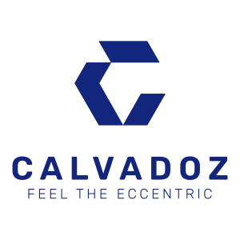

<div id="top"></div>
<!-- PROJECT LOGO -->
<br />
<div align="center">
  <a href="https://github.com/github_username/repo_name">
    
  </a>

<h3 align="center">Javadoz - Your Personalized JAV Assistant</h3>

  <p align="center">
    <b>
      <i style={{ marginRight: 3 }}>'Javadoz'</i>
    </b>
    is a hobby project created by Calvadoz himself.
    <br />
    This project purely for fun and to support the Discord Community
    of Calvadoz "Secret" Lab <b><i>"#gasm-lab"</i></b><br />
    <br />
    Special thanks to: <b>R18</b> and <b>JavDatabase</b> for all
    movie metadata
    <br />
    Please consider supporting the industry by purchasing the
    original work from
    <a
      href="https://www.r18.com/"
      title="Visit R18.com"
      target="_blank"
      rel="noreferrer"
      style={{ verticalAlign: "sub", marginLeft: 4 }}
    >
      
    </a>
    <br />
    <br />
    <br />
    <a href="https://github.com/calvadoz/javbot-dashboard">View Demo</a>
    ·
    <a href="https://github.com/calvadoz/javbot-dashboard/issues">Report Bug</a>
    ·
    <a href="https://github.com/calvadoz/javbot-dashboard/issues">Request Feature</a>
  </p>
</div>

<!-- TABLE OF CONTENTS -->
<details>
  <summary>Table of Contents</summary>
  <ol>
    <li>
      <a href="#about-the-project">About The Project</a>
      <ul>
        <li><a href="#built-with">Built With</a></li>
      </ul>
    </li>
    <li>
      <a href="#getting-started">Getting Started</a>
      <ul>
        <li><a href="#prerequisites">Prerequisites</a></li>
        <li><a href="#installation">Installation</a></li>
      </ul>
    </li>
    <li><a href="#usage">Usage</a></li>
    <li><a href="#roadmap">Roadmap</a></li>
    <li><a href="#contributing">Contributing</a></li>
    <li><a href="#license">License</a></li>
    <li><a href="#contact">Contact</a></li>
    <li><a href="#acknowledgments">Acknowledgments</a></li>
  </ol>
</details>

<!-- ABOUT THE PROJECT -->

## About The Project

![Product Name Screen Shot][product-screenshot]
![Product Name Screen Shot][product-screenshot2]

<p align="right">(<a href="#top">back to top</a>)</p>

### Built With

<!-- - [Next.js](https://nextjs.org/) -->

- [React.js](https://reactjs.org/)
- [Node.js](https://nodejs.org/)
- [Firebase.js](https://firebase.com/)
- [Puppeteer](https://github.com/puppeteer/puppeteer)
  <!-- - [Vue.js](https://vuejs.org/) -->
  <!-- - [Angular](https://angular.io/) -->
  <!-- - [Svelte](https://svelte.dev/) -->
  <!-- - [Laravel](https://laravel.com) -->
  <!-- - [Bootstrap](https://getbootstrap.com) -->
  <!-- - [JQuery](https://jquery.com) -->

<p align="right">(<a href="#top">back to top</a>)</p>

<!-- GETTING STARTED -->

## Getting Started

### Prerequisites

This also requires you to run the server side code found at <a href="https://github.com/calvadoz/project-javadoz">here</a>

- npm
  ```sh
  npm install npm@latest -g
  ```
  This website requires you to have your own personal Firebase configuration and pass it as environment variable

```
const firebaseConfig = {
  apiKey: process.env.REACT_APP_FIREBASE_API_KEY,
  authDomain: process.env.REACT_APP_FIREBASE_AUTH_DOMAIN,
  // The value of databaseURL depends on the location of the database
  databaseURL: process.env.REACT_APP_FIREBASE_DATABASE_URL,
  projectId: process.env.REACT_APP_FIREBASE_PROJECT_ID,
  storageBucket: process.env.REACT_APP_FIREBASE_STORAGE_BUCKET,
  messagingSenderId: process.env.REACT_APP_FIREBASE_MESSAGING_SENDER_ID,
  appId: process.env.REACT_APP_FIREBASE_APP_ID,
  // For Firebase JavaScript SDK v7.20.0 and later, measurementId is an optional field
  measurementId: process.env.REACT_APP_FIREBASE_MEASUREMENT_ID,
};
```

### Installation

1. Make sure your Firebase config is up and running, pointing to your own account
2. Clone the repo
   ```sh
   git clone https://github.com/calvadoz/javbot-dashboard.git
   ```
3. Install NPM packages
   ```sh
   npm install
   ```
4. Run App
   ```sh
   npm start
   ```

<p align="right">(<a href="#top">back to top</a>)</p>

<!-- USAGE EXAMPLES -->

<!-- ## Usage

Use this space to show useful examples of how a project can be used. Additional screenshots, code examples and demos work well in this space. You may also link to more resources.

_For more examples, please refer to the [Documentation](https://example.com)_

<p align="right">(<a href="#top">back to top</a>)</p> -->

<!-- ROADMAP -->

## Roadmap

- [ ] Lazy Loading for better performance
- [ ] UI highlight on search

See the [open issues](https://github.com/calvadoz/javbot-dashboard/issues) for a full list of proposed features (and known issues).

<p align="right">(<a href="#top">back to top</a>)</p>

<!-- CONTRIBUTING -->

## Contributing

Contributions are what make the open source community such an amazing place to learn, inspire, and create. Any contributions you make are **greatly appreciated**.

If you have a suggestion that would make this better, please fork the repo and create a pull request. You can also simply open an issue with the tag "enhancement".
Don't forget to give the project a star! Thanks again!

1. Fork the Project
2. Create your Feature Branch (`git checkout -b feature/AmazingFeature`)
3. Commit your Changes (`git commit -m 'Add some AmazingFeature'`)
4. Push to the Branch (`git push origin feature/AmazingFeature`)
5. Open a Pull Request

<p align="right">(<a href="#top">back to top</a>)</p>

<!-- LICENSE -->

## License

Distributed under the MIT License. See `LICENSE.txt` for more information.

<p align="right">(<a href="#top">back to top</a>)</p>

<!-- CONTACT -->

## Contact

Your Name - [@calvadozz](https://twitter.com/calvadozzzz) - wu.kelvin91@gmail.com

Project Link: [https://github.com/calvadoz/javbot-dashboard](https://github.com/calvadoz/javbot-dashboard)

<p align="right">(<a href="#top">back to top</a>)</p>

<!-- ACKNOWLEDGMENTS -->

## Acknowledgments

- [Exelquiz - as my hands on beta tester]()
- [Entire thanks to my Discord community for requesting movie]()
- [Discord Bot API](https://discord.com)
- [Malven's Flexbox Cheatsheet](https://flexbox.malven.co/)
- [Malven's Grid Cheatsheet](https://grid.malven.co/)
- [Img Shields](https://shields.io)
- [GitHub Pages](https://pages.github.com)
- [Font Awesome](https://fontawesome.com)
- [React Toastify](https://www.npmjs.com/package/react-toastify)
- [R18](https://r18.com)
- [JavDatabase](https://javdatabase.com)


<p align="right">(<a href="#top">back to top</a>)</p>

<!-- MARKDOWN LINKS & IMAGES -->
<!-- https://www.markdownguide.org/basic-syntax/#reference-style-links -->

[contributors-shield]: https://img.shields.io/github/contributors/github_username/repo_name.svg?style=for-the-badge
[contributors-url]: https://github.com/github_username/repo_name/graphs/contributors
[forks-shield]: https://img.shields.io/github/forks/github_username/repo_name.svg?style=for-the-badge
[forks-url]: https://github.com/github_username/repo_name/network/members
[stars-shield]: https://img.shields.io/github/stars/github_username/repo_name.svg?style=for-the-badge
[stars-url]: https://github.com/github_username/repo_name/stargazers
[issues-shield]: https://img.shields.io/github/issues/github_username/repo_name.svg?style=for-the-badge
[issues-url]: https://github.com/github_username/repo_name/issues
[license-shield]: https://img.shields.io/github/license/github_username/repo_name.svg?style=for-the-badge
[license-url]: https://github.com/calvadoz/javbot-dashboard/blob/main/LICENSE.txt
[linkedin-shield]: https://img.shields.io/badge/-LinkedIn-black.svg?style=for-the-badge&logo=linkedin&colorB=555
[linkedin-url]: https://linkedin.com/in/kelvin-wu-a3929b56
[product-screenshot]: images/javadoz-1.jpg
[product-screenshot2]: images/javadoz-2.jpg
